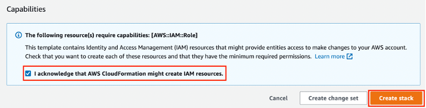

# Amazon SageMaker MLOps: from idea to production in six steps


This repository contains a sequence of simple notebooks demonstrating how to move from an ML idea to production by using [Amazon SageMaker](https://aws.amazon.com/sagemaker).

The notebooks make use of SageMaker [processing](https://docs.aws.amazon.com/sagemaker/latest/dg/processing-job.html) and [training](https://docs.aws.amazon.com/sagemaker/latest/dg/train-model.html) jobs, and SageMaker MLOps features such as [SageMaker Pipelines](https://aws.amazon.com/sagemaker/pipelines/), [SageMaker Feature Store](https://aws.amazon.com/sagemaker/feature-store/), [SageMaker Model Registry](https://docs.aws.amazon.com/sagemaker/latest/dg/model-registry.html), [SageMaker managed MLflow experiments](https://docs.aws.amazon.com/sagemaker/latest/dg/mlflow.html), and [SageMaker Model Monitor](https://aws.amazon.com/sagemaker/model-monitor/).

You start with a simple notebook with basic ML code for data preprocessing, feature engineering, and model training, all local to the notebook. Each subsequent notebook builds on top of the previous and introduces one or several SageMaker MLOps features:


Each notebook also provides links to useful hands-on resources and proposes real-world ideas for additional development.

You follow along the six notebooks and develop your ML idea from an experimental notebook to a production-ready solution following the recommended MLOps practices:


## Additional topics
There are also additional hands-on examples of other SageMaker features and ML topics, like [A/B testing](https://docs.aws.amazon.com/sagemaker/latest/dg/model-validation.html), custom [processing](https://docs.aws.amazon.com/sagemaker/latest/dg/build-your-own-processing-container.html), [training](https://docs.aws.amazon.com/sagemaker/latest/dg/your-algorithms-training-algo.html) and [inference](https://docs.aws.amazon.com/sagemaker/latest/dg/your-algorithms-inference-main.html) containers, [debugging and profiling](https://docs.aws.amazon.com/sagemaker/latest/dg/train-debugger.html), [security](https://docs.aws.amazon.com/sagemaker/latest/dg/security.html), [multi-model](https://docs.aws.amazon.com/sagemaker/latest/dg/multi-model-endpoints.html) and [multi-container](https://docs.aws.amazon.com/sagemaker/latest/dg/multi-container-endpoints.html) endpoints, and [serial inference pipelines](https://docs.aws.amazon.com/sagemaker/latest/dg/inference-pipelines.html). Explore the notebooks in the folder `additional-topics` to test out these features.

## Getting started
For the full version of the instructions and detailed setup of the account refer to the public AWS workshop [Amazon SageMaker MLOps: from idea to production in six steps](https://catalog.workshops.aws/mlops-from-idea-to-production).

### Prerequisites
You need an **AWS account**. If you don't already have an account, follow the [Setting Up Your AWS Environment](https://aws.amazon.com/getting-started/guides/setup-environment/) getting started guide for a quick overview.

### AWS Instructor-led workshop
If you participating in an AWS Immersion Day or a similar instructor-led event and would like to use a provided AWS account, please follow this [instructions](https://catalog.workshops.aws/mlops-from-idea-to-production/en-US/00-introduction/20-getting-started-workshop-studio) how to claim your temporary AWS account and how to start SageMaker Studio. 

❗ Skip the following steps **Set up Amazon SageMaker domain** and **Deploy CloudFormation template** if you use an AWS-provisioned account.

### Set up Amazon SageMaker domain
To run the notebooks you must use [SageMaker Studio](https://aws.amazon.com/sagemaker/studio/) which requires a [SageMaker domain](https://docs.aws.amazon.com/sagemaker/latest/dg/studio-entity-status.html).

#### Existing SageMaker domain
If you already have a SageMaker domain and would like to use it to run the workshop, follow the [SageMaker Studio setup guide](https://aws.amazon.com/getting-started/hands-on/machine-learning-tutorial-set-up-sagemaker-studio-account-permissions/) to attach the required AWS IAM policies to the IAM execution role used by your Studio user profile. For this workshop you must attach the following managed IAM policies to the IAM execution role of the user profile you use to run the workshop:
- `AmazonSageMakerFullAccess`
- `AWSCloudFormationFullAccess`
- `AWSCodePipeline_FullAccess`
- `AmazonSageMakerPipelinesIntegrations`

You can also [create a new user profile](https://docs.aws.amazon.com/sagemaker/latest/dg/domain-user-profile-add-remove.html) with a dedicated IAM execution role to use for this workshop.

#### Provision a new SageMaker domain
If you don't have a SageMaker domain or would like to use a dedicated domain for the workshop, you must create a new domain.

❗ If you have more than one domain in your account, consider the limit of the active domains in a Region in an account.

To create a new domain, you can follow the onboarding [instructions](https://docs.aws.amazon.com/sagemaker/latest/dg/onboard-quick-start.html) in the Developer Guide or use the provided AWS CloudFormation [template](https://github.com/aws-samples/amazon-sagemaker-from-idea-to-production/blob/master/cfn-templates/sagemaker-domain.yaml) that creates a SageMaker domain, a user profile, and adds the IAM roles required for executing the provided notebooks.

❗ If you create a new domain via AWS Console, make sure you attach the following policies to the IAM execution role of the user profile:
- `AmazonSageMakerFullAccess`
- `AWSCloudFormationFullAccess`
- `AWSCodePipeline_FullAccess`
- `AmazonSageMakerPipelinesIntegrations`

❗ If you use the provided CloudFormation template for domain creation, the template creates an IAM execution role with the following policies attached:
- `AmazonSageMakerFullAccess`
- `AmazonS3FullAccess`
- `AWSCloudFormationFullAccess`
- `AWSCodePipeline_FullAccess`
- `AmazonSageMakerPipelinesIntegrations`

Download the [`sagemaker-domain.yaml` CloudFormation template](https://github.com/aws-samples/amazon-sagemaker-from-idea-to-production/blob/master/cfn-templates/sagemaker-domain.yaml).

This template creates a new SageMaker domain and a user profile named `studio-user-<UUID>`. It also creates the required IAM execution role for the domain. 

❗ This stack assumes that you already have a public VPC set up in your account. If you do not have a public VPC, see [VPC with a single public subnet](https://docs.aws.amazon.com/vpc/latest/userguide/VPC_Scenario1.html) to learn how to create a public VPC. 

❗ The template supports only `us-east-1`, `us-west-2`, and `eu-central-1` Regions. Select one of those regions for deployment.

Open [AWS CloudFormation console](https://us-east-1.console.aws.amazon.com/cloudformation/home?region=us-east-1#/stacks/create). The link opens the AWS CloudFormation console in your AWS account. Check the selected region and change it if needed. 
- Select **Upload a template file** and upload the downloaded CloudFormation template, click **Next** 
- Enter the stack name, for example `sagemaker-from-idea-to-prod`, click **Next**
- Leave all defaults on this pane, click **Next**
- Select **I acknowledge that AWS CloudFormation might create IAM resources**, click **Submit**



On the **CloudFormation** pane, choose **Stacks**. It takes about 15 minutes for the stack to be created. When the stack is created, the status of the stack changes from `CREATE_IN_PROGRESS` to `CREATE_COMPLETE`. 


### Start SageMaker Studio
After signing into the AWS account, follow [Launch Amazon SageMaker Studio](https://docs.aws.amazon.com/sagemaker/latest/dg/studio-updated-launch.html) instructions to open Studio.

Here are the instructions if you are in an AWS-led workshop event:

1. First navigate to Amazon SageMaker console, you can do this by simply starting to type `SageMaker` in the search box at the top. 

   

2. On the left in the `Applications and IDEs` section select Studio
3. In the `Get started` box, make sure the studio-user-xxxxxxxx is selected and select `Open studio`. Now SageMaker Studio UI opens in a new browser tab and you're redirected to that window.

   

4. Optionally take the quick tour of the SageMAker Studio interface by selecting the `Take quick tour button` or select `Skip Tour for now``
5. Accept or Decline the cookie preferences based on your preference

### Open JupyterLab space
You use a JupyterLab space as our IDE for this workshop. 

1. To launch a JupyterLab space, select the `JupyterLab` app in the top left

   
   
2. Each application in SageMaker studio gets its own space. Spaces are used to manage the storage and resource needs of each application. If you're participating in an AWS-led workshop or used the provided CloudFormation template, the required space is already created for you, otherwise you must create a new JupyterLab space as described in the [the Developer Guide](ttps://docs.aws.amazon.com/sagemaker/latest/dg/studio-updated-jl-user-guide.html) or re-use an existing one

3. Run the space by selecting the run button on the right. This process can take a few seconds.

   

4. Once the space is running select `Open` to navigate to the JupyterLab application. 

### Start the workshop
If you're participating in an AWS-led workshop or used the provided CloudFormation template, the workshop content is cloned on the space EBS volume automatically, no action required from you. If you use your own domain and user profile or created a domain via AWS Console UI, follow the instructions in the next section **Download notebooks into your JupyterLab space** to clone the content.

The public GitHub repository [Amazon SageMaker MLOps: from idea to production in six steps](https://github.com/aws-samples/amazon-sagemaker-from-idea-to-production) contains all source code.

#### Download notebooks into your JupyterLab space
You only need to clone the notebooks into your space if you use your own domain and user profile. To do this select `Terminal` in the JupyterLab Launcher window or select **File** > **New** > **Terminal** to open up a terminal and run the `git clone`:

```sh
git clone https://github.com/aws-samples/amazon-sagemaker-from-idea-to-production.git
```

This will clone the repository into the local JupyterLab file system.

#### Open and execute a setup notebook
As the final preparatory step, make sure to run and execute the `00-start-here.ipynb` notebook. To do this

1. In the file browser open the `amazon-sagemaker-from-idea-to-production` folder by double clicking it
2. Open `00-start-here.ipynb` notebook and follow the instructions in the notebook


Note: we recommend you read and then execute each cell by using the `Shift + Enter`command.

After executing the `00-start-here.ipynb` notebook, you can move to the first notebook [`01-idea-development`](01-idea-development.ipynb).

## How to use this workshop
You can do this workshop in two ways:
- Go through the provided notebooks, execute code cells sequentially, and follow the instructions and execution flow
- Write your own code with hands-on assignments and exercises

The following diagram shows the possible flows of the workshop:


### Execution mode
Use this mode if you're not familiar with Python programming and new to Jupyter notebooks. You follow each notebook `00-...`, `01-...`, ..., `06-...`and execute all code cells with `Shift` + `Enter`. The given instructions explain what code is doing and why. You need about two and half hours to run through all code cells in all notebooks. 
All notebooks and all code cells are idempotent. Make sure you run all code cells sequentially, top to bottom.

### Assignment mode
Use this mode if you have experience working with Jupyter notebooks and would like to write own code to have a deeper hands-on understanding of SageMaker features and SageMaker Python SDK.
Each foundational instruction notebook `00-...`, `01-...`, ..., `06-...` in the workshop root folder has a corresponding "assignment" notebook with exercises in the `assignments` folder. First, go through the instructions in the root folder notebook and then complete the exercises in the corresponding assignment notebook. The notebooks are mapped as follows:
- `00-start-here` > `./assignments/00-assignment-setup`
- `01-idea-development` > `./assignments/01-assignment-local-development`
- `02-sagemaker-containers` > `./assignments/02-assignment-sagemaker-containers`
- `03-sagemaker-pipeline` > `./assignments/03-assignment-sagemaker-pipeline`
- `04-sagemaker-projects` > `./assignments/04-assignment-sagemaker-project`
- `05-deploy` > `./assignments/05-assignment-deploy`
- `06-monitoring` > `./assignments/06-assignment-monitoring`

## Clean-up
❗ You don't need to perform a clean-up if you run an AWS-instructor led workshop.

To avoid charges, you must remove all project-provisioned and generated resources from your AWS account. 

First, run all steps in the provided [clean-up notebook](99-clean-up.ipynb).
Second, if you used the AWS Console to provision a domain for this workshop, and don't need the domain, you can delete the domain by following [this instructions](https://docs.aws.amazon.com/sagemaker/latest/dg/gs-studio-delete-domain.html). 

If you provisioned a domain use a CloudFormation template, you can delete the CloudFormation stack in the AWS console.

If you provisioned a new VPC for the domain, go to the [VPC console](https://console.aws.amazon.com/vpc/home?#vpcs) and delete the provisioned VPC.

## Dataset
This example uses the [direct marketing dataset](https://archive.ics.uci.edu/ml/datasets/bank+marketing) from UCI's ML Repository:
> [Moro et al., 2014] S. Moro, P. Cortez and P. Rita. A Data-Driven Approach to Predict the Success of Bank Telemarketing. Decision Support Systems, Elsevier, 62:22-31, June 2014

## Resources
The following list presents some useful hands-on resources to help you to get started with ML development on Amazon SageMaker.

- [Get started with Amazon SageMaker](https://aws.amazon.com/sagemaker/getting-started/)
- [Deep Learning MLOps workshop with Amazon SageMaker](https://catalog.us-east-1.prod.workshops.aws/workshops/47906c57-854e-4c73-abdb-6b49fe364370/en-US)
- [Amazon SageMaker 101 workshop](https://catalog.us-east-1.prod.workshops.aws/workshops/0c6b8a23-b837-4e0f-b2e2-4a3ffd7d645b/en-US)
- [Amazon SageMaker 101 workshop code repository](https://github.com/aws-samples/sagemaker-101-workshop)
- [Amazon SageMaker Immersion Day](https://catalog.us-east-1.prod.workshops.aws/workshops/63069e26-921c-4ce1-9cc7-dd882ff62575/en-US)
- [Amazon SageMaker End to End Workshop](https://github.com/aws-samples/sagemaker-end-to-end-workshop)
- [Amazon SageMaker workshop with BYOM and BYOC examples](https://sagemaker-workshop.com/)
- [End to end Machine Learning with Amazon SageMaker](https://github.com/aws-samples/amazon-sagemaker-build-train-deploy)
- [SageMaker MLOps Workshop](https://catalog.us-east-1.prod.workshops.aws/workshops/1bb7ba03-e533-464f-8726-91a74513b1a1/en-US)
- [Amazon SageMaker MLOps Workshop](https://catalog.us-east-1.prod.workshops.aws/workshops/7acdc7d8-0ac0-44de-bd9b-e3407147a59c/en-US)
- [A curated list of awesome references for Amazon SageMaker](https://github.com/aws-samples/awesome-sagemaker)
- [AWS Multi-Account Data & ML Governance Workshop](https://catalog.us-east-1.prod.workshops.aws/workshops/367f5c92-0764-4959-9279-e6f105f0c670/en-US)

---

## QR code for this repository
Use the following QR code to link this repository.


[https://bit.ly/3KkhzYW](https://bit.ly/3KkhzYW)

## QR code for the workshop
Use the following QR code to link the public AWS [workshop](https://catalog.workshops.aws/mlops-from-idea-to-production/en-US).


[https://bit.ly/3zjk07S](https://bit.ly/3zjk07S)

---

Copyright Amazon.com, Inc. or its affiliates. All Rights Reserved.
SPDX-License-Identifier: MIT-0


###PORTUGUES

Aqui está a tradução do documento README:

# Amazon SageMaker MLOps: da ideia à produção em seis etapas


Este repositório contém uma sequência de notebooks simples demonstrando como passar de uma ideia de ML para a produção usando o [Amazon SageMaker](https://aws.amazon.com/sagemaker).

Os notebooks utilizam jobs de [processamento](https://docs.aws.amazon.com/sagemaker/latest/dg/processing-job.html) e [treinamento](https://docs.aws.amazon.com/sagemaker/latest/dg/train-model.html) do SageMaker, e recursos de MLOps do SageMaker como [SageMaker Pipelines](https://aws.amazon.com/sagemaker/pipelines/), [SageMaker Feature Store](https://aws.amazon.com/sagemaker/feature-store/), [SageMaker Model Registry](https://docs.aws.amazon.com/sagemaker/latest/dg/model-registry.html), [experimentos MLflow gerenciados pelo SageMaker](https://docs.aws.amazon.com/sagemaker/latest/dg/mlflow.html) e [SageMaker Model Monitor](https://aws.amazon.com/sagemaker/model-monitor/).

Você começa com um notebook simples contendo código básico de ML para pré-processamento de dados, engenharia de features e treinamento de modelo, tudo local ao notebook. Cada notebook subsequente se baseia no anterior e introduz um ou vários recursos de MLOps do SageMaker:


Cada notebook também fornece links para recursos práticos úteis e propõe ideias do mundo real para desenvolvimento adicional.

Você segue os seis notebooks e desenvolve sua ideia de ML de um notebook experimental para uma solução pronta para produção seguindo as práticas recomendadas de MLOps:


## Tópicos adicionais
Há também exemplos práticos adicionais de outros recursos do SageMaker e tópicos de ML, como [testes A/B](https://docs.aws.amazon.com/sagemaker/latest/dg/model-validation.html), containers personalizados de [processamento](https://docs.aws.amazon.com/sagemaker/latest/dg/build-your-own-processing-container.html), [treinamento](https://docs.aws.amazon.com/sagemaker/latest/dg/your-algorithms-training-algo.html) e [inferência](https://docs.aws.amazon.com/sagemaker/latest/dg/your-algorithms-inference-main.html), [depuração e perfilamento](https://docs.aws.amazon.com/sagemaker/latest/dg/train-debugger.html), [segurança](https://docs.aws.amazon.com/sagemaker/latest/dg/security.html), endpoints [multi-modelo](https://docs.aws.amazon.com/sagemaker/latest/dg/multi-model-endpoints.html) e [multi-container](https://docs.aws.amazon.com/sagemaker/latest/dg/multi-container-endpoints.html), e [pipelines de inferência em série](https://docs.aws.amazon.com/sagemaker/latest/dg/inference-pipelines.html). Explore os notebooks na pasta `additional-topics` para testar esses recursos.

## Começando
Para a versão completa das instruções e configuração detalhada da conta, consulte o workshop público da AWS [Amazon SageMaker MLOps: da ideia à produção em seis etapas](https://catalog.workshops.aws/mlops-from-idea-to-production).

### Pré-requisitos
Você precisa de uma **conta AWS**. Se você ainda não tem uma conta, siga o guia de primeiros passos [Configurando seu Ambiente AWS](https://aws.amazon.com/getting-started/guides/setup-environment/) para uma visão geral rápida.

### Workshop conduzido por instrutor da AWS
Se você está participando de um AWS Immersion Day ou um evento similar conduzido por instrutor e gostaria de usar uma conta AWS fornecida, siga estas [instruções](https://catalog.workshops.aws/mlops-from-idea-to-production/en-US/00-introduction/20-getting-started-workshop-studio) sobre como reivindicar sua conta AWS temporária e como iniciar o SageMaker Studio.

❗ Pule as etapas seguintes **Configurar domínio Amazon SageMaker** e **Implantar modelo CloudFormation** se você estiver usando uma conta provisionada pela AWS.

### Configurar domínio Amazon SageMaker
Para executar os notebooks, você deve usar o [SageMaker Studio](https://aws.amazon.com/sagemaker/studio/), que requer um [domínio SageMaker](https://docs.aws.amazon.com/sagemaker/latest/dg/studio-entity-status.html).

#### Domínio SageMaker existente
Se você já tem um domínio SageMaker e gostaria de usá-lo para executar o workshop, siga o [guia de configuração do SageMaker Studio](https://aws.amazon.com/getting-started/hands-on/machine-learning-tutorial-set-up-sagemaker-studio-account-permissions/) para anexar as políticas IAM AWS necessárias à função de execução IAM usada pelo seu perfil de usuário do Studio. Para este workshop, você deve anexar as seguintes políticas IAM gerenciadas à função de execução IAM do perfil de usuário que você usa para executar o workshop:
- `AmazonSageMakerFullAccess`
- `AWSCloudFormationFullAccess`
- `AWSCodePipeline_FullAccess`
- `AmazonSageMakerPipelinesIntegrations`

Você também pode [criar um novo perfil de usuário](https://docs.aws.amazon.com/sagemaker/latest/dg/domain-user-profile-add-remove.html) com uma função de execução IAM dedicada para usar neste workshop.

#### Provisionar um novo domínio SageMaker
Se você não tem um domínio SageMaker ou gostaria de usar um domínio dedicado para o workshop, você deve criar um novo domínio.

❗ Se você tiver mais de um domínio em sua conta, considere o limite de domínios ativos em uma Região em uma conta.

Para criar um novo domínio, você pode seguir as [instruções](https://docs.aws.amazon.com/sagemaker/latest/dg/onboard-quick-start.html) de integração no Guia do Desenvolvedor ou usar o [modelo](https://github.com/aws-samples/amazon-sagemaker-from-idea-to-production/blob/master/cfn-templates/sagemaker-domain.yaml) AWS CloudFormation fornecido que cria um domínio SageMaker, um perfil de usuário e adiciona as funções IAM necessárias para executar os notebooks fornecidos.

❗ Se você criar um novo domínio via Console AWS, certifique-se de anexar as seguintes políticas à função de execução IAM do perfil de usuário:
- `AmazonSageMakerFullAccess`
- `AWSCloudFormationFullAccess`
- `AWSCodePipeline_FullAccess`
- `AmazonSageMakerPipelinesIntegrations`

❗ Se você usar o modelo CloudFormation fornecido para criação de domínio, o modelo cria uma função de execução IAM com as seguintes políticas anexadas:
- `AmazonSageMakerFullAccess`
- `AmazonS3FullAccess`
- `AWSCloudFormationFullAccess`
- `AWSCodePipeline_FullAccess`
- `AmazonSageMakerPipelinesIntegrations`

Baixe o [modelo CloudFormation `sagemaker-domain.yaml`](https://github.com/aws-samples/amazon-sagemaker-from-idea-to-production/blob/master/cfn-templates/sagemaker-domain.yaml).

Este modelo cria um novo domínio SageMaker e um perfil de usuário chamado `studio-user-<UUID>`. Ele também cria a função de execução IAM necessária para o domínio.

❗ Esta pilha assume que você já tem uma VPC pública configurada em sua conta. Se você não tiver uma VPC pública, consulte [VPC com uma única sub-rede pública](https://docs.aws.amazon.com/vpc/latest/userguide/VPC_Scenario1.html) para aprender como criar uma VPC pública.

❗ O modelo suporta apenas as regiões `us-east-1`, `us-west-2` e `eu-central-1`. Selecione uma dessas regiões para implantação.

Abra o [console AWS CloudFormation](https://us-east-1.console.aws.amazon.com/cloudformation/home?region=us-east-1#/stacks/create). O link abre o console AWS CloudFormation em sua conta AWS. Verifique a região selecionada e altere-a se necessário.
- Selecione **Upload a template file** e faça o upload do modelo CloudFormation baixado, clique em **Next**
- Digite o nome da pilha, por exemplo `sagemaker-from-idea-to-prod`, clique em **Next**
- Deixe todos os padrões neste painel, clique em **Next**
- Selecione **I acknowledge that AWS CloudFormation might create IAM resources**, clique em **Submit**


No painel **CloudFormation**, escolha **Stacks**. Leva cerca de 15 minutos para que a pilha seja criada. Quando a pilha é criada, o status da pilha muda de `CREATE_IN_PROGRESS` para `CREATE_COMPLETE`.


### Iniciar SageMaker Studio
Após fazer login na conta AWS, siga as instruções [Iniciar Amazon SageMaker Studio](https://docs.aws.amazon.com/sagemaker/latest/dg/studio-updated-launch.html) para abrir o Studio.

Aqui estão as instruções se você estiver em um evento de workshop liderado pela AWS:

1. Primeiro, navegue até o console do Amazon SageMaker, você pode fazer isso simplesmente começando a digitar `SageMaker` na caixa de pesquisa no topo.

   

2. À esquerda, na seção `Applications and IDEs`, selecione Studio
3. Na caixa `Get started`, certifique-se de que studio-user-xxxxxxxx está selecionado e selecione `Open studio`. Agora a interface do SageMaker Studio abre em uma nova aba do navegador e você é redirecionado para essa janela.

   

4. Opcionalmente, faça o tour rápido da interface do SageMaker Studio selecionando o botão `Take quick tour` ou selecione `Skip Tour for now`
5. Aceite ou recuse as preferências de cookies com base em sua preferência

### Abrir espaço JupyterLab
Você usa um espaço JupyterLab como nossa IDE para este workshop.

1. Para iniciar um espaço JupyterLab, selecione o aplicativo `JupyterLab` no canto superior esquerdo

   
   
2. Cada aplicativo no SageMaker Studio recebe seu próprio espaço. Os espaços são usados para gerenciar as necessidades de armazenamento e recursos de cada aplicativo. Se você estiver participando de um workshop liderado pela AWS ou usou o modelo CloudFormation fornecido, o espaço necessário já está criado para você, caso contrário, você deve criar um novo espaço JupyterLab conforme descrito no [Guia do Desenvolvedor](https://docs.aws.amazon.com/sagemaker/latest/dg/studio-updated-jl-user-guide.html) ou reutilizar um existente

3. Execute o espaço selecionando o botão de execução à direita. Este processo pode levar alguns segundos.

   

4. Assim que o espaço estiver em execução, selecione `Open` para navegar até o aplicativo JupyterLab.

### Iniciar o workshop
Se você estiver participando de um workshop liderado pela AWS ou usou o modelo CloudFormation fornecido, o conteúdo do workshop é clonado automaticamente no volume EBS do espaço, nenhuma ação é necessária da sua parte. Se você usar seu próprio domínio e perfil de usuário ou criou um domínio via interface do usuário do Console AWS, siga as instruções na próxima seção **Baixar notebooks para seu espaço JupyterLab** para clonar o conteúdo.

O repositório público do GitHub [Amazon SageMaker MLOps: da ideia à produção em seis etapas](https://github.com/aws-samples/amazon-sagemaker-from-idea-to-production) contém todo o código-fonte.

#### Baixar notebooks para seu espaço JupyterLab
Você só precisa clonar os notebooks em seu espaço se usar seu próprio domínio e perfil de usuário. Para fazer isso, selecione `Terminal` na janela do Launcher do JupyterLab ou selecione **File** > **New** > **Terminal** para abrir um terminal e execute o `git clone`:

```sh
git clone https://github.com/aws-samples/amazon-sagemaker-from-idea-to-production.git
```

Isso clonará o repositório no sistema de arquivos local do JupyterLab.

#### Abrir e executar um notebook de configuração
Como etapa preparatória final, certifique-se de executar o notebook `00-start-here.ipynb`. Para fazer isso:

1. No navegador de arquivos, abra a pasta `amazon-sagemaker-from-idea-to-production` clicando duas vezes nela
2. Abra o notebook `00-start-here.ipynb` e siga as instruções no notebook


Nota: recomendamos que você leia e depois execute cada célula usando o comando `Shift + Enter`.

Após executar o notebook `00-start-here.ipynb`, você pode passar para o primeiro notebook [`01-idea-development`](01-idea-development.ipynb).

## Como usar este workshop
Você pode fazer este workshop de duas maneiras:
- Percorra os notebooks fornecidos, execute as células de código sequencialmente e siga as instruções e o fluxo de execução
- Escreva seu próprio código com tarefas práticas e exercícios

O diagrama a seguir mostra os possíveis fluxos do workshop:


### Modo de execução
Use este modo se você não estiver familiarizado com programação Python e for novo em notebooks Jupyter. Você segue cada notebook `00-...`, `01-...`, ..., `06-...` e executa todas as células de código com `Shift` + `Enter`. As instruções fornecidas explicam o que o código está fazendo e por quê. Você precisa de cerca de duas horas e meia para executar todas as células de código em todos os notebooks.
Todos os notebooks e todas as células de código são idempotentes. Certifique-se de executar todas as células de código sequencialmente, de cima para baixo.

### Modo de tarefa
Use este modo se você tem experiência trabalhando com notebooks Jupyter e gostaria de escrever seu próprio código para ter uma compreensão prática mais profunda dos recursos do SageMaker e do SDK Python do SageMaker.
Cada notebook de instrução fundamental `00-...`, `01-...`, ..., `06-...` na pasta raiz do workshop tem um notebook de "tarefa" correspondente com exercícios na pasta `assignments`. Primeiro, percorra as instruções no notebook da pasta raiz e depois complete os exercícios no notebook de tarefa correspondente. Os notebooks são mapeados da seguinte forma:
- `00-start-here` > `./assignments/00-assignment-setup`
- `01-idea-development` > `./assignments/01-assignment-local-development`
- `02-sagemaker-containers` > `./assignments/02-assignment-sagemaker-containers`
- `03-sagemaker-pipeline` > `./assignments/03-assignment-sagemaker-pipeline`
- `04-sagemaker-projects` > `./assignments/04-assignment-sagemaker-project`
- `05-deploy` > `./assignments/05-assignment-deploy`
- `06-monitoring` > `./assignments/06-assignment-monitoring`

## Limpeza
❗ Você não precisa realizar uma limpeza se estiver executando um workshop conduzido por um instrutor da AWS.

Para evitar cobranças, você deve remover todos os recursos provisionados e gerados pelo projeto de sua conta AWS.

Primeiro, execute todas as etapas no [notebook de limpeza](99-clean-up.ipynb) fornecido.
Segundo, se você usou o Console AWS para provisionar um domínio para este workshop e não precisa do domínio, você pode excluir o domínio seguindo [estas instruções](https://docs.aws.amazon.com/sagemaker/latest/dg/gs-studio-delete-domain.html).

Se você provisionou um domínio usando um modelo CloudFormation, você pode excluir a pilha CloudFormation no console AWS.

Se você provisionou uma nova VPC para o domínio, vá para o [console VPC](https://console.aws.amazon.com/vpc/home?#vpcs) e exclua a VPC provisionada.

## Conjunto de dados
Este exemplo usa o [conjunto de dados de marketing direto](https://archive.ics.uci.edu/ml/datasets/bank+marketing) do Repositório ML da UCI:
> [Moro et al., 2014] S. Moro, P. Cortez and P. Rita. A Data-Driven Approach to Predict the Success of Bank Telemarketing. Decision Support Systems, Elsevier, 62:22-31, June 2014

## Recursos
A lista a seguir apresenta alguns recursos práticos úteis para ajudá-lo a começar com o desenvolvimento de ML no Amazon SageMaker.

- [Comece com o Amazon SageMaker](https://aws.amazon.com/sagemaker/getting-started/)
- [Workshop de Deep Learning MLOps com Amazon SageMaker](https://catalog.us-east-1.prod.workshops.aws/workshops/47906c57-854e-4c73-abdb-6b49fe364370/en-US)
- [Workshop Amazon SageMaker 101](https://catalog.us-east-1.prod.workshops.aws/workshops/0c6b8a23-b837-4e0f-b2e2-4a3ffd7d645b/en-US)
- [Repositório de código do workshop Amazon SageMaker 101](https://github.com/aws-samples/sagemaker-101-workshop)
- [Amazon SageMaker Immersion Day](https://catalog.us-east-1.prod.workshops.aws/workshops/63069e26-921c-4ce1-9cc7-dd882ff62575/en-US)
- [Workshop Amazon SageMaker de ponta a ponta](https://github.com/aws-samples/sagemaker-end-to-end-workshop)
- [Workshop Amazon SageMaker com exemplos BYOM e BYOC](https://sagemaker-workshop.com/)
- [Machine Learning de ponta a ponta com Amazon SageMaker](https://github.com/aws-samples/amazon-sagemaker-build-train-deploy)
- [Workshop SageMaker MLOps](https://catalog.us-east-1.prod.workshops.aws/workshops/1bb7ba03-e533-464f-8726-91a74513b1a1/en-US)
- [Workshop Amazon SageMaker MLOps](https://catalog.us-east-1.prod.workshops.aws/workshops/7acdc7d8-0ac0-44de-bd9b-e3407147a59c/en-US)
- [Uma lista curada de referências incríveis para o Amazon SageMaker](https://github.com/aws-samples/awesome-sagemaker)
- [Workshop de Governança de Dados e ML Multi-Conta AWS](https://catalog.us-east-1.prod.workshops.aws/workshops/367f5c92-0764-4959-9279-e6f105f0c670/en-US)

---

## Código QR para este repositório
Use o seguinte código QR para vincular este repositório.


[https://bit.ly/3KkhzYW](https://bit.ly/3KkhzYW)

## Código QR para o workshop
Use o seguinte código QR para vincular o [workshop](https://catalog.workshops.aws/mlops-from-idea-to-production/en-US) público da AWS.


[https://bit.ly/3zjk07S](https://bit.ly/3zjk07S)

---

Copyright Amazon.com, Inc. ou suas afiliadas. Todos os direitos reservados.
SPDX-License-Identifier: MIT-0